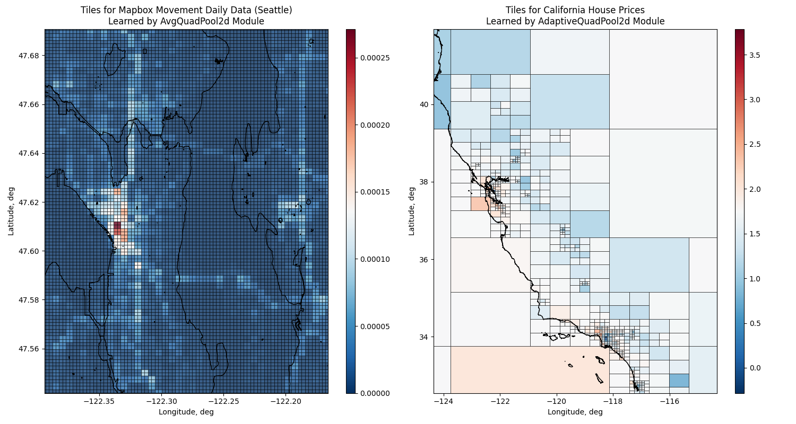

==========================================
The geospatial pooling library for PyTorch
==========================================

The Torch Geopooling library is an extension for PyTorch library that provide extra layers for
building geospatial neural networks.

Here is an example of how you can use modules from Torch Geopooling library to train neural
networks predicting geospatial features:

Installation
------------

The library is distributed as PyPI package, to install that package, execute the following
command:

.. code:: shell

    pip install torch_geopooling

You can use the `torch_geopooling` library for building neural networks with geospatial indexing.
The interface of the provided modules is compatible with `PyTorch`_ library, including automatic
gradient computation.

Usage
-----

The module provides adaptive and regular modules that implement decomposition of point coordinates
in 2-dimensional space. Decomposition in this context implies separation of the space into
rectangles (quads).

Adaptive modules are building the decomposition during the training, while for regular modules
the decomposition should be computed beforehand. As a result, adaptive module builds sparse
decomposition, while regular module builds dense (regular) decomposition.

Using adaptive decomposition module for `EPSG:4326`_ coordinates:

.. code:: python

    import torch
    from torch_geopooling.nn import AdaptiveQuadPool2d

    # Create 5-feature vector for each node in a decomposition.
    pool = AdaptiveQuadPool2d(5, (-180, -90, 360, 180), max_depth=12, capacity=10)
    input = torch.DoubleTensor(1024, 2).uniform_(-30, 30)
    output = pool(input)

Using regular decomposition module for arbitrary polygon:

.. code:: python

    import torch
    from shapely import Polygon
    from torch_geopooling.nn import QuadPool2d

    # Polygon for regular decomposition should be within an exterior boundary.
    poly = Polygon([(0.0, 0.0), (10.0, 0.0), (10.0, 10.0), (0.0, 10.0)])
    exterior = (-100.0, -100.0, 200.0, 200.0)
    # Create 3-feature vector for each node in a decomposition.
    pool = QuadPool2d(3, poly, exterior, max_depth=10)
    input = torch.DoubleTensor(200, 2).uniform(0.0, 10.0)
    output = pool(input)

Documentation
-------------

Consider visiting the guides and API reference for further implementation and usage details.

- :doc:`guide/index`
- :doc:`reference/index`

.. toctree::
   :hidden:
   :caption: Documentation
   :maxdepth: 1

   guide/index
   reference/index

.. toctree::
   :hidden:
   :caption: Project Links
   :maxdepth: 1

   GitHub <https://github.com/ybubnov/torch_geopooling>
   PyPI <https://pypi.org/project/torch_geopooling>

.. _PyTorch: https://pytorch.org
.. _EPSG:4326: https://epsg.io/4326
